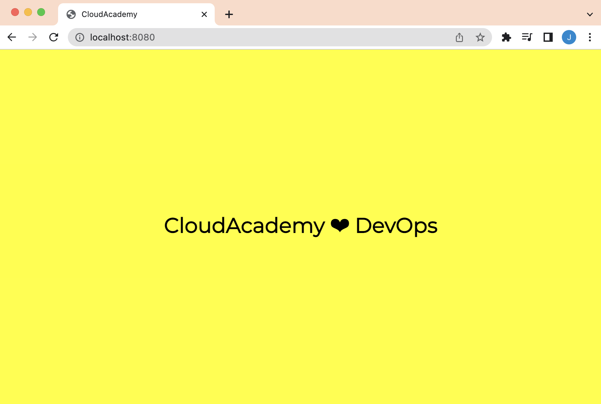

 


# Web Echo App
A simple web based application that prints a message on a coloured background, both of which can be configured using environment variables.

## Usage
To start the web application, configure the following optional environment variables:
 - `HOSTPORT=0.0.0.0:8080`
 - `MESSAGE="CloudAcademy ❤ DevOps"`
 - `BACKGROUND_COLOR=yellow`
 - `AUTO_RELOAD=30`

## Build
The following commands can be used to build and package the source code:

Current operating system:
```
go build .
```

**Linux** operating system:
```
CGO_ENABLED=0 GOOS=linux GOARCH=amd64 go build -o webapp
```

**macOS** operating system:
```
CGO_ENABLED=0 GOOS=darwin GOARCH=amd64 go build -o webapp
```

Docker:
```
docker buildx build --platform=linux/amd64 -t cloudacademydevops/webappecho .
```

## Startup:

Example 1:
```
./webapp
```

Example 2:
```
HOSTPORT=0.0.0.0:8080 MESSAGE="CloudAcademy ❤ DevOps" BACKGROUND_COLOR=cyan ./webapp
```

Example 3:
```
HOSTPORT=0.0.0.0:8080 MESSAGE="CloudAcademy ❤ DevOps" BACKGROUND_COLOR=yellow AUTO_RELOAD=30 ./webapp
```



## Docker
The web application has been packaged into a Docker image. The Docker image can be pulled with the following command:

```
docker pull cloudacademydevops/webappecho
```

Use the following command to launch the web echoing application within Docker:
```
docker run --name webapp \
--env MESSAGE=CloudAcademy \
--env BACKGROUND_COLOR=yellow \
--env AUTO_RELOAD=30 \
-p 8080:8080 cloudacademydevops/webappecho
```

## Kubernetes
Use the following command to launch the web echoing application as a Deployment resource within a cluster:

```
cat << EOF | kubectl apply -f -
apiVersion: apps/v1
kind: Deployment
metadata:
  name: webecho
  namespace: cloudacademy
  labels:
    app: webecho
    version: v1
spec:
  replicas: 2
  selector:
    matchLabels:
      app: webecho
      version: v1
  template:
    metadata:
      labels:
        app: webecho
        version: v1
    spec:
      containers:
      - name: webecho
        image: cloudacademydevops/webappecho
        imagePullPolicy: IfNotPresent
        command: ["/go/bin/webapp"]
        ports:
        - containerPort: 8080
        env:
        - name: MESSAGE
          value: "CloudAcademy ❤ DevOps"
        - name: BACKGROUND_COLOR
          value: yellow
        - name: AUTO_RELOAD
          value: 30
EOF
```